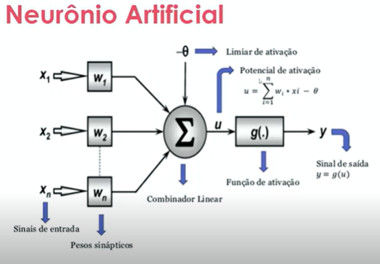
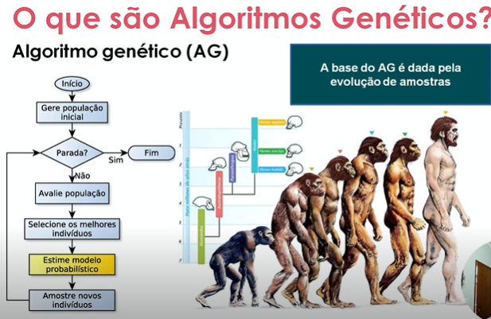

# Machine Learning

## Introdução

- Um sistema de aprendizado de máquina é capaz de aprender a partir de exemplos.
- IA Geral x IA Restrita.
- Robô Sophia - primeiro robô a ter cidadania.
- Por meio de Machine Learning obtemos uma IA Restrita.
- Bibliotecas mencionadas: 
    - Tensorflow
    - Scikit learn
    - Pandas
- Redes mencionadas
    - Yolo
    - Inception V3 - rede de classificação de imagens usada em celulares    

## Inteligência Artificial

- A inteligência artificial (IA) é um campo amplo da ciência da computação que busca criar sistemas capazes de simular a inteligência humana, como tomada de decisão, aprendizado e reconhecimento de padrões.

## Aprendizado de Máquina

- O aprendizado de máquina (machine learning, ML) é um subconjunto da IA que se concentra em criar algoritmos que permitem que os sistemas aprendam a partir de dados, ajustando-se e melhorando suas respostas ou previsões sem serem explicitamente programados para isso.
- Tipos
    - Aprendizado por Reforço

## IA X ML

- IA é o objetivo geral, ML é uma das ferramentas para alcançá-lo.

## Inteligência Artificial Geral

- Dos filmes, dirigir carro, etc...

## Inteligência Artificial Restrita

- Obtida a partir de algum método de ML.
- Restrita a alguns problemas.

## Métodos de Machine Learning bioinspirados

- Algoritmos bioinspirados: inspirados no comportamento de seres vivos em convívio social
    - Ex.: colônia de formigas, colônia de abelhas
- Usam métodos heurísticos (não determinísticos - há um conjunto de respostas)
- Lógica Fuzzy: 
    - "lógica nebulosa"
    - Qual o tamano de uma pessoa alta?

## Algorítmos determinísticos

- ex.: 2 + 2 = 4

## Algorítmos heurísticos    

- ex.: entre 10 pessoas qual é a mais bonita? 
- usa lógica fuzzy ou lógica difusa (há uma região de busca)

## Redes Neurais Artificiais (RNA)

- São algoritmos bioinspirados
- Biologicamente são as interligações entre os neurônios biológicos
- Um Neurônio artificial é formado por:
    - sinais de entrada (x1, x2, x3, ...)
    - pesos sinápticos (w1, w2, w3, ...)
    - combinador linear (faz uma combinação com os sinais de entrada)
    - função de ativação (interpreta a saída do combinador linear)
    - sinal de saída (resposta)

    

<!-- ********************************************************************* Transcrito a mão até aqui  -->

## Treinamento de uma rede neural artificial    

- As camadas ocultas da RN selecionam as características (features) importantes para o reconhecimento de um gato, por exemplo.
- Dataset: base de treino
    - numa pasta insere fotos de gatos, noutra de cachorros
- Treinar uma RN é atribuir valroes aos pesos da rede
    - O arquivo de pesos pode ser um arquivo .txt, ele é o conhecimento adquirido
    - A rede neural é só um modelo matemático, o aprendizado está nos pesos
    - Transfer Learning: retirar o aprendizado de uma rede e inserir em outra (usado em robótica)

## Classificação de Objetos

- havendo 4 neurônios de saída teremos 4 valores de saída

## Algoritmos Genéticos (AG)

- É uma técnica de busca utilizada para encontrar soluções aproximaas em problemas de otimização e busca
- Inspirados no comportamento genético
- São algoritmos heurísticos (e não determinísticos)
- Aplicações
    - Robótica - amostras para desvios de rota
    - IA
    - Jogos Digitais
    - Geração de Novos dados
    - Chatbots - combinar respostas/perguntas para o usuário - deixa o sistema mais próximo de uma interação humana
    - Roteamento de redes - encontrar o melhor caminho para o fluxo de dados
- **Funcionamento**
    - Gera de forma aleatória uma população inicial de indivíduos
    - Executa a Função de Fitness (Função avaliação)
        - Avalia se as amostras estão dentro de um intervalo desejado
        - Seleciona melhores indivíduos (melhores amostras)
    - Gera, a partir dos melhores indivíduos, uma população pré-selecionada que será recombinada (pais)
    - Os pais geram recombinações (filhos)
    - Executa a Função de Fitness novamente (agora para os filhos)
        - Gera uma nova população
    - Executa a função de mutação 
        - inverte um bit, por exemplo. Pequena sempre
    - Executa a Função de Fitness novamente 
        - Pega a solução melhor (melhores amostras) - ótimo global

## Métodos para Algoritmos Genéticos

